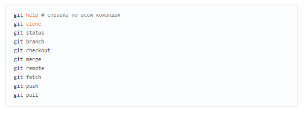

# Привет Мир!
## Инструкция для работы с Git
___
Сегодня мы изучим программу для контроля версий Git и запишем небольшую инструкцию для для нее. 

Осваивать Git будем с помощью языка разметки Markdown.

Git - самая  популярная система контроля 
версий, но не единственная. Алгоритм 
работы подобных систем схож.

Для начала изучим команды Git.

## Команды

1. git --version

    Данная команда позволяет узнать версию Git, установленную на компухтер.
    
    Моя версия - *2.37.2.windows.2*

2. git init

    Команда для инициализации репозитария. Создадим папку, в которой git начнёт отслеживать изменения.
В папке создаётся скрытая папка .git

3. git add

    Команда добавляет файлы, которые Git должен отслеживать. Эта команда дается после добавления файлов. Писать название целиком не обязательно: терминал дозаполнит данные автоматически.

4. git commit

    Команда git commit берёт все данные добавленные в индекс с помощью git add, и сохраняет их слепок во внутренней базе данных, а затем сдвигает указатель текущей ветки на этот слепок.

    По сути данная команда делает checkpoint (сохранение) как в играх, чтобы мы в любой момент могли вернуться в него. ***Но для этого файл должен быть сохранен.***

    Также добавив -m "текст" мы можем написать комментарий.

5. git diff

    Показывает разницу между текущим файлом и сохранённым Перед переключением версии файла в Git используйте команду git log, чтобы увидеть количество сохранений.

6. git log

    Команда вызывающая журнал изменений. При её наборе можно увидеть кто и когда сделал изменения, а также код коммита и комментарий.
    
    Перед переключением версии файла в Git используйте команду git log, чтобы увидеть количество сохранени.

7. git checkout

    Команда для переключение между версиями/коммитами. Введя данную команду и код коммита мы вернемся в данный "слепок" работы. 
    
    Для работы нужно указать не только интересующий вас коммит, но и вернуться в тот, где работаем, при помощи команды git checkout master.

8. git status
    
    Команда показывает что происходит с файлом. Отслеживает или нет его Git. Изменилось ли что-то в файле или нет. И т.д.

9. git branch
    
    Команда выводит список веток. Если необходимо создать дополнительную ветку, то к этой комманде добавляем имя новой ветки.

10. git branch -d <имя ветки для удаления>

    Удаление ветки.

11. git log -graph

    Комманда для отображения графа.

12. git merge <имя ветки>

    Комманда для объединения веток. Сливает ветку <имя ветки> с той веткой в которой мы находимся в данный момент.

## Инструкция для работы с Markdown
___

### Выделение текста
Чтобы выделить текст курсивом, необходимо обрамить его звездочками (*) или знаком нижнего подчеркивания (_). 
Например, *Таким образом* или _таким_.

Чтобы выделить текст полужирным, необходимо обрамить его двумя звездочками (**) или двойным знаком нижнего подчеркивания (__).
Например, **Таким образом** или __таким__.

Альтернативные способы выделения текста жирным или курсивом нужны для того чтобы мы могли совмещать оба этих способа. 
Например, _текст может выделен курсивом и при этом быть **полужирным**._  

### Списки
Чтобы выделить ненумерованный список используйте звездочку (*)

Чтобы добавить ненумерованные списки, неорбходимо пункты выделить звездочкой (*) или знаком плюс (+). Например, вот так:
* Элемент 1
* Элемент 2
* Элемент 3
+ Элемент 4

Чтобы добавить нумерованные списки, неорбходимо пункты пронумеровать. Например, вот так:
1. Элемент 1
2. Элемент 2
3. Элемент 3

### Работа с изображениями
Чтобы вставить изображение в текст, необходимо написать  следующее:

### Ссылки

Markdown поодерживает два стиля оформления ссылок:
* Гиперссылка с немедленным указанием адреса (внутритекстовая).

    [Пример](https://gist.github.com/Jekins/2bf2d0638163f1294637#Links "Статья, которая помогла мне")

    Синтаксис данной ссылки [Текст, который будет отображаться](URL-адрес "Текст который будет отображаться при наведениии курсора на ссылку")

    Т.е. сама ссылка обрамляется круглыми скобками, перед ними в квадратных записывается текст ссылки (то что будет видно вместо ссылки). Внутри круглых скобок в кавычках после ссылки пишется текст, который будет виден при наведении курсора.

    Конечно же все эти тексты не являются обязательными элементами к ссылке, они служат для пояснения. 

* Гиперссылка подобная сноске.

    [Example]

    [Example]:[https://gist.github.com/Jekins/2bf2d0638163f1294637#Links] "Description"
    
    Надеюсь понятно как я это сделал?)

    Сначала в квадратных скобках записали текст который будет отображаться вместо ссылки. А затем в любом месте документа в квадратных скобках написали что за ссылка скрыта за текстом. По сути вначале написали переменную, а потом приравняли её к определенному значению.

### Работа с таблицами

<<<<<<< HEAD
Это просто, и я сейчас покажу!
=======
Таблицы| в Markdown| создаются| так
---|:---:|---:|---|
Вот столбец 1|Выровнен по середине|Выровнен по правому краю| 3
Вот столбец 2|---|Amazing|3
А вот столбец 3|---|WOW!|3
Ну и напоследок|---|Way-wey!|---

Для того чтобы создать таблицу, необходимо записать столбцы через черточку ( | ). Во второй строке проставить тире (-), естественно с разделением в виде черточки между столбцами. Последующие строки заполняются аналогично первой. Количество тире любое, но не менее одного. Для выравнивания текста в столбце по середине тире необходимо обрамить двоеточием ( : ), для выравнивания справа - двоеточием справа.

Надеюсь понятно!)
>>>>>>> tables

### Цитаты
## Заключение